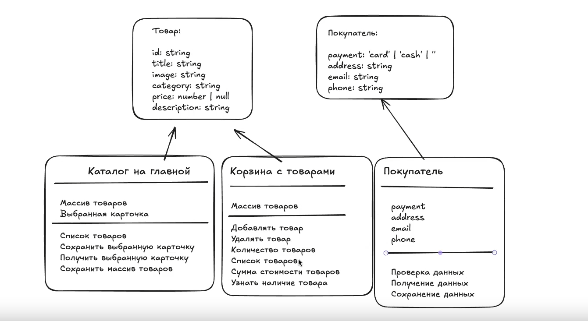

# Проектная работа "Веб-ларек"

Стек: HTML, SCSS, TS, Vite

Структура проекта:

- src/ — исходные файлы проекта
- src/components/ — папка с JS компонентами
- src/components/base/ — папка с базовым кодом

Важные файлы:

- index.html — HTML-файл главной страницы
- src/types/index.ts — файл с типами
- src/main.ts — точка входа приложения
- src/scss/styles.scss — корневой файл стилей
- src/utils/constants.ts — файл с константами
- src/utils/utils.ts — файл с утилитами

## Установка и запуск

Для установки и запуска проекта необходимо выполнить команды

```
npm install
npm run dev
```

или

```
yarn
yarn dev
```

## Сборка

```
npm run build
```

или

```
yarn build
```

# Интернет-магазин «Web-Larёk»

«Web-Larёk» — это интернет-магазин с товарами для веб-разработчиков, где пользователи могут просматривать товары, добавлять их в корзину и оформлять заказы. Сайт предоставляет удобный интерфейс с модальными окнами для просмотра деталей товаров, управления корзиной и выбора способа оплаты, обеспечивая полный цикл покупки с отправкой заказов на сервер.

## Архитектура приложения

Код приложения разделен на слои согласно парадигме MVP (Model-View-Presenter), которая обеспечивает четкое разделение ответственности между классами слоев Model и View. Каждый слой несет свой смысл и ответственность:

Model - слой данных, отвечает за хранение и изменение данных.  
View - слой представления, отвечает за отображение данных на странице.  
Presenter - презентер содержит основную логику приложения и отвечает за связь представления и данных.

Взаимодействие между классами обеспечивается использованием событийно-ориентированного подхода. Модели и Представления генерируют события при изменении данных или взаимодействии пользователя с приложением, а Презентер обрабатывает эти события используя методы как Моделей, так и Представлений.

### Базовый код

#### Класс Component

Является базовым классом для всех компонентов интерфейса.
Класс является дженериком и принимает в переменной `T` тип данных, которые могут быть переданы в метод `render` для отображения.

Конструктор:  
`constructor(container: HTMLElement)` - принимает ссылку на DOM элемент за отображение, которого он отвечает.

Поля класса:  
`container: HTMLElement` - поле для хранения корневого DOM элемента компонента.

Методы класса:  
`render(data?: Partial<T>): HTMLElement` - Главный метод класса. Он принимает данные, которые необходимо отобразить в интерфейсе, записывает эти данные в поля класса и возвращает ссылку на DOM-элемент. Предполагается, что в классах, которые будут наследоваться от `Component` будут реализованы сеттеры для полей с данными, которые будут вызываться в момент вызова `render` и записывать данные в необходимые DOM элементы.  
`setImage(element: HTMLImageElement, src: string, alt?: string): void` - утилитарный метод для модификации DOM-элементов ``

#### Класс Api

Содержит в себе базовую логику отправки запросов.

Конструктор:  
`constructor(baseUrl: string, options: RequestInit = {})` - В конструктор передается базовый адрес сервера и опциональный объект с заголовками запросов.

Поля класса:  
`baseUrl: string` - базовый адрес сервера  
`options: RequestInit` - объект с заголовками, которые будут использованы для запросов.

Методы:  
`get(uri: string): Promise<object>` - выполняет GET запрос на переданный в параметрах ендпоинт и возвращает промис с объектом, которым ответил сервер  
`post(uri: string, data: object, method: ApiPostMethods = 'POST'): Promise<object>` - принимает объект с данными, которые будут переданы в JSON в теле запроса, и отправляет эти данные на ендпоинт переданный как параметр при вызове метода. По умолчанию выполняется `POST` запрос, но метод запроса может быть переопределен заданием третьего параметра при вызове.  
`handleResponse(response: Response): Promise<object>` - защищенный метод проверяющий ответ сервера на корректность и возвращающий объект с данными полученный от сервера или отклоненный промис, в случае некорректных данных.

#### Класс EventEmitter

Брокер событий реализует паттерн "Наблюдатель", позволяющий отправлять события и подписываться на события, происходящие в системе. Класс используется для связи слоя данных и представления.

Конструктор класса не принимает параметров.

Поля класса:  
`_events: Map<string | RegExp, Set<Function>>)` - хранит коллекцию подписок на события. Ключи коллекции - названия событий или регулярное выражение, значения - коллекция функций обработчиков, которые будут вызваны при срабатывании события.

Методы класса:  
`on<T extends object>(event: EventName, callback: (data: T) => void): void` - подписка на событие, принимает название события и функцию обработчик.  
`emit<T extends object>(event: string, data?: T): void` - инициализация события. При вызове события в метод передается название события и объект с данными, который будет использован как аргумент для вызова обработчика.  
`trigger<T extends object>(event: string, context?: Partial<T>): (data: T) => void` - возвращает функцию, при вызове которой инициализируется требуемое в параметрах событие с передачей в него данных из второго параметра.



##### Данные

Интерфейс IProduct:
Отвечает за правильную типизацию полчаемых от сервера/извне данных.
Содержит поля
`id` - уникальный id товара типа string,
`description` - описание товара типа string,
`title` - название товара типа string,
`image` - ссылка на изображение товара типа string,
`category` - категория товара типа string,
и `price` - цена товара типа number|null.

Интерфейс ICustomer:
Отвечает за правильную типизацию данных, отправляемых на сервер (или куда-либо) формами при заказе товаров из корзины.
Содержит поля
`email` - указанная в форме электронная почта типа string,
`phone` - указанный в форме номер телефона типа string,
`address` - указанный адрес типа string,
и `payment` - вид оплаты приведенного типа TPayment со значением 'card'|'cash'|''.

###### Модели данных

Модели данных описаны классами
`MainCatalogModel` - отображает все товары доступные на сайте,
`CartModel` - корзина с уже выбранными товарами,
`CustomerModel` - данные покупателя для отправки формы заказа

MainCatalogModel - класс описывающий доступные для покупки на сайте позиции товаров.
`Конструктор класса` - записывает принимаемый массив данных с обьектами типа IProducts в поле класса '\_catalogProducts' с помощью сеттера 'setCatalogProducts';
Содержит поля:
`private _catalogProducts: IProduct[] = []` - массив обьектов товаров типа IProducts, по умолчанию пустой;
`private _selectedProduct: IProduct|null = null` - выбранный обьект типа IProducts или null, по умолчанию null.
Содержит методы:
`set catalogProducts(products: IProduct[])` - set-метод для помещения принимаемого обьекта типа IProducts в массив обьектов \_catalogProducts;
`get catalogProducts(): IProduct[]` - get-метод для \_catalogProducts;
`set selectedProduct(productId: string)` - set-метод для \_selectedProduct, находит по принимаемым данным типа string обьект в массиве \_catalogProducts по полю id, при помощи метода getProductById;
`get selectedProduct(): IProduct | null` - get-метод для \_selectedProduct;
`getProductById(id: string): IProduct | null` - получение одного товара по его id.

CartModel - класс, описывающий выбранные покупателем товары, которые можно удалять, добавлять, и получать данные о них.
Содержит поле:
`private _itemsInCart: IProduct[] = []` - массив сохраненных (положенных в корзину) товаров типа IProducts, по умолчанию пустой.
Содержит методы:
`get itemsInCart():IProduct[]` - геттер - добавляет в массив товар типа массив обьектов IProduct;
`putItemInCart (selectedProduct: IProduct): void` - кладет обьект или типа IProducts в массив \_itemsInCart, проверяя по id есть ли он уже с помощью метода hasItem, и можно ли его купить (price !== null);
`deleteItemFromCart (selectedProduct: IProduct): IProduct[]` - удаляет из массива \_itemsInCart обьект продукта, отфильтровывая его с помощью .filter и возвращая отфильтрованный массив;
`clearCart(): void` - очистить массив \_itemsInCart, удаляя из него все товары;
`productsCount (): number` - возвращает общее число всех товаров в массиве \_itemsInCart;
`totalPrice ():number` - вывести общую сумму всех товаров в корзине, суммируя поля price всех обьектов в \_itemsInCart с помощью reduceж;
`getItemById(productId: string): IProduct | null` - возвращает обьект из массива \_itemsInCart по его id, или null если не нашел, с помощью функции .find;
`hasItem` - метод проверяющий наличие обьекта в массиве \_itemsInCart, в отличие от getItemById возвращает булевое значение.

CustomerModel - класс, описывающий и сохраняющий данные о пользователе, что были введены в форме оформления заказа.
Содержит отдельный интерфейс `interface IValidationResult` для результатов метода валидации.
Содержит поле
`private _customerData: ICustomer` - обьект типа ICustomer с полями типа string внутри, пустыми изначально (""). Содержит поля: payment, email, phone, adress;
Содержит методы:
`set customerData(data: Partial<ICustomer>)` - сеттер для \_customerData, сохранение всех данных сразу одним методом, или одного/нескольких за раз, без удаления не переданных в параметры;
`get customerData(): ICustomer` - геттер для \_customerData;
`get payment() `- отдельный геттер для поля payment;
`get email()` - отдельный геттер для поля email;
`get phone()` - отдельный геттер для поля phone;
`get address()` - отдельный геттер для поля address;
`clearСustomerData(): void` - очистка поля \_customerData, удаление всех данных пользователя;
`validate(): IValidationResult` - содержит внутри циклы для проверки для проверки всех полей сразу, и вспомогательные приватные методы для этого.
`get isComplete(): boolean` - выводит булевую часть возвращаемого методом validate() обьекта, говорящую все ли данные пользователя правильно введены
`get validationErrors(): Record<keyof ICustomer, string>` - выводит обьект типа IValidationResults, содержащий сообщения о неверно введенных полях.

###### Слой коммуникации

Описан классом ApiService, использующий Api для отправки запросов на сервер, принимающий от сервера ответы как для get так и для post-запросов.
Использует интерфейсы:
`IApi` - для стандартизации запросов для Api класса;
`IProductsResponse` - интерфейс для ответа с сервера с товарами;
`IOrderRequest` - данные для отправки заказа на сервер - - данные покупателя, общая сумма заказа и массив id товаров;
`IOrderResponse` - данные от сервера при успешной отправке заказа - id успешно отправленного post-запроса на сервер и общая сумма заказа;
`IOrderInput` - данные которые передаются в postOrder - данные покупателя и товары в коризне;
`IProduct` - интерфейс для обьекта товара;

Содержит методы:
`getProducts` - получает от Api данные типа IProductResponse и возвращает .items - массив товаров
`postOrder` - принимает данные типа IOrderInput в функции sendOrderExample(), использует вспомогательный метод prepareOrderData, который обрабатывает данные и готовит запрос на сервер типа IOrderRequest
`prepareOrderData` - вспомогательный метод, который превращает данные IOrderInput в IOrderRequest, а также фильтрует их и готовит общую сумму заказа(total) и массив id товаров(itemsId), которые затем уже используются в post-запросе

ApiService инициализируется в main.ts и используется в функциях loadProducts() и sendOrderExample() там же
