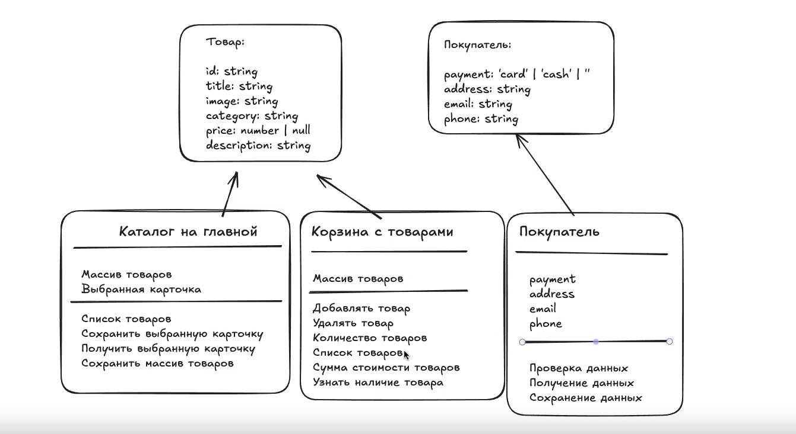

# Проектная работа "Веб-ларек"

Стек: HTML, SCSS, TS, Vite

Структура проекта:

- src/ — исходные файлы проекта
- src/components/ — папка с JS компонентами
- src/components/base/ — папка с базовым кодом

Важные файлы:

- index.html — HTML-файл главной страницы
- src/types/index.ts — файл с типами
- src/main.ts — точка входа приложения
- src/scss/styles.scss — корневой файл стилей
- src/utils/constants.ts — файл с константами
- src/utils/utils.ts — файл с утилитами

## Установка и запуск

Для установки и запуска проекта необходимо выполнить команды

```
npm install
npm run dev
```

или

```
yarn
yarn dev
```

## Сборка

```
npm run build
```

или

```
yarn build
```

# Интернет-магазин «Web-Larёk»

«Web-Larёk» — это интернет-магазин с товарами для веб-разработчиков, где пользователи могут просматривать товары, добавлять их в корзину и оформлять заказы. Сайт предоставляет удобный интерфейс с модальными окнами для просмотра деталей товаров, управления корзиной и выбора способа оплаты, обеспечивая полный цикл покупки с отправкой заказов на сервер.

## Архитектура приложения

Код приложения разделен на слои согласно парадигме MVP (Model-View-Presenter), которая обеспечивает четкое разделение ответственности между классами слоев Model и View. Каждый слой несет свой смысл и ответственность:

Model - слой данных, отвечает за хранение и изменение данных.  
View - слой представления, отвечает за отображение данных на странице.  
Presenter - презентер содержит основную логику приложения и отвечает за связь представления и данных.

Взаимодействие между классами обеспечивается использованием событийно-ориентированного подхода. Модели и Представления генерируют события при изменении данных или взаимодействии пользователя с приложением, а Презентер обрабатывает эти события используя методы как Моделей, так и Представлений.

### Базовый код

#### Класс Component

Является базовым классом для всех компонентов интерфейса.
Класс является дженериком и принимает в переменной `T` тип данных, которые могут быть переданы в метод `render` для отображения.

Конструктор:  
`constructor(container: HTMLElement)` - принимает ссылку на DOM элемент за отображение, которого он отвечает.

Поля класса:  
`container: HTMLElement` - поле для хранения корневого DOM элемента компонента.

Методы класса:  
`render(data?: Partial<T>): HTMLElement` - Главный метод класса. Он принимает данные, которые необходимо отобразить в интерфейсе, записывает эти данные в поля класса и возвращает ссылку на DOM-элемент. Предполагается, что в классах, которые будут наследоваться от `Component` будут реализованы сеттеры для полей с данными, которые будут вызываться в момент вызова `render` и записывать данные в необходимые DOM элементы.  
`setImage(element: HTMLImageElement, src: string, alt?: string): void` - утилитарный метод для модификации DOM-элементов ``

#### Класс Api

Содержит в себе базовую логику отправки запросов.

Конструктор:  
`constructor(baseUrl: string, options: RequestInit = {})` - В конструктор передается базовый адрес сервера и опциональный объект с заголовками запросов.

Поля класса:  
`baseUrl: string` - базовый адрес сервера  
`options: RequestInit` - объект с заголовками, которые будут использованы для запросов.

Методы:  
`get(uri: string): Promise<object>` - выполняет GET запрос на переданный в параметрах ендпоинт и возвращает промис с объектом, которым ответил сервер  
`post(uri: string, data: object, method: ApiPostMethods = 'POST'): Promise<object>` - принимает объект с данными, которые будут переданы в JSON в теле запроса, и отправляет эти данные на ендпоинт переданный как параметр при вызове метода. По умолчанию выполняется `POST` запрос, но метод запроса может быть переопределен заданием третьего параметра при вызове.  
`handleResponse(response: Response): Promise<object>` - защищенный метод проверяющий ответ сервера на корректность и возвращающий объект с данными полученный от сервера или отклоненный промис, в случае некорректных данных.

#### Класс EventEmitter

Брокер событий реализует паттерн "Наблюдатель", позволяющий отправлять события и подписываться на события, происходящие в системе. Класс используется для связи слоя данных и представления.

Конструктор класса не принимает параметров.

Поля класса:  
`_events: Map<string | RegExp, Set<Function>>)` - хранит коллекцию подписок на события. Ключи коллекции - названия событий или регулярное выражение, значения - коллекция функций обработчиков, которые будут вызваны при срабатывании события.

Методы класса:  
`on<T extends object>(event: EventName, callback: (data: T) => void): void` - подписка на событие, принимает название события и функцию обработчик.  
`emit<T extends object>(event: string, data?: T): void` - инициализация события. При вызове события в метод передается название события и объект с данными, который будет использован как аргумент для вызова обработчика.  
`trigger<T extends object>(event: string, context?: Partial<T>): (data: T) => void` - возвращает функцию, при вызове которой инициализируется требуемое в параметрах событие с передачей в него данных из второго параметра.



##### Данные

Интерфейс IProduct:
Отвечает за правильную типизацию полчаемых от сервера/извне данных.
Содержит поля
`id` - уникальный id товара типа string,
`description` - описание товара типа string,
`title` - название товара типа string,
`image` - ссылка на изображение товара типа string,
`category` - категория товара типа string,
и `price` - цена товара типа number|null.

Интерфейс ICustomer:
Отвечает за правильную типизацию данных, отправляемых на сервер (или куда-либо) формами при заказе товаров из корзины.
Содержит поля
`email` - указанная в форме электронная почта типа string,
`phone` - указанный в форме номер телефона типа string,
`address` - указанный адрес типа string,
и `payment` - вид оплаты приведенного типа TPayment со значением 'card'|'cash'|''.

###### Модели данных

Модели данных описаны классами
`MainCatalogModel` - отображает все товары доступные на сайте,
`CartModel` - корзина с уже выбранными товарами,
`CustomerModel` - данные покупателя для отправки формы заказа

MainCatalogModel - класс описывающий доступные для покупки на сайте позиции товаров.
`Конструктор класса` - записывает принимаемый массив данных с обьектами типа IProducts в поле класса '\_catalogProducts' с помощью сеттера 'setCatalogProducts';
Содержит поля:
`private _catalogProducts: IProduct[] = []` - массив обьектов товаров типа IProducts, по умолчанию пустой;
`private _selectedProduct: IProduct|null = null` - выбранный обьект типа IProducts или null, по умолчанию null.
Содержит методы:
`set catalogProducts(products: IProduct[])` - set-метод для помещения принимаемого обьекта типа IProducts в массив обьектов \_catalogProducts;
`get catalogProducts(): IProduct[]` - get-метод для \_catalogProducts;
`set selectedProduct(productId: string)` - set-метод для \_selectedProduct, находит по принимаемым данным типа string обьект в массиве \_catalogProducts по полю id, при помощи метода getProductById;
`get selectedProduct(): IProduct | null` - get-метод для \_selectedProduct;
`getProductById(id: string): IProduct | null` - получение одного товара по его id.

CartModel - класс, описывающий выбранные покупателем товары, которые можно удалять, добавлять, и получать данные о них.
Содержит поле:
`private _itemsInCart: IProduct[] = []` - массив сохраненных (положенных в корзину) товаров типа IProducts, по умолчанию пустой.
Содержит методы:
`get itemsInCart():IProduct[]` - геттер - добавляет в массив товар типа массив обьектов IProduct;
`putItemInCart (selectedProduct: IProduct): void` - кладет обьект или типа IProducts в массив \_itemsInCart, проверяя по id есть ли он уже с помощью метода hasItem, и можно ли его купить (price !== null);
`deleteItemFromCart (selectedProduct: IProduct): IProduct[]` - удаляет из массива \_itemsInCart обьект продукта, отфильтровывая его с помощью .filter и возвращая отфильтрованный массив;
`clearCart(): void` - очистить массив \_itemsInCart, удаляя из него все товары;
`productsCount (): number` - возвращает общее число всех товаров в массиве \_itemsInCart;
`totalPrice ():number` - вывести общую сумму всех товаров в корзине, суммируя поля price всех обьектов в \_itemsInCart с помощью reduceж;
`getItemById(productId: string): IProduct | null` - возвращает обьект из массива \_itemsInCart по его id, или null если не нашел, с помощью функции .find;
`hasItem` - метод проверяющий наличие обьекта в массиве \_itemsInCart, в отличие от getItemById возвращает булевое значение.

CustomerModel - класс, описывающий и сохраняющий данные о пользователе, что были введены в форме оформления заказа.
Содержит отдельный интерфейс `interface IValidationResult` для результатов метода валидации.
Содержит поле
`private _customerData: ICustomer` - обьект типа ICustomer с полями типа string внутри, пустыми изначально (""). Содержит поля: payment, email, phone, adress;
Содержит методы:
`set customerData(data: Partial<ICustomer>)` - сеттер для \_customerData, сохранение всех данных сразу одним методом, или одного/нескольких за раз, без удаления не переданных в параметры;
`get customerData(): ICustomer` - геттер для \_customerData;
`get payment() `- отдельный геттер для поля payment;
`get email()` - отдельный геттер для поля email;
`get phone()` - отдельный геттер для поля phone;
`get address()` - отдельный геттер для поля address;
`clearСustomerData(): void` - очистка поля \_customerData, удаление всех данных пользователя;
`validate(): IValidationResult` - содержит внутри циклы для проверки для проверки всех полей сразу, и вспомогательные приватные методы для этого.
`get isComplete(): boolean` - выводит булевую часть возвращаемого методом validate() обьекта, говорящую все ли данные пользователя правильно введены
`get validationErrors(): Record<keyof ICustomer, string>` - выводит обьект типа IValidationResults, содержащий сообщения о неверно введенных полях.

###### Слой коммуникации

Описан классом ApiService, использующий Api для отправки запросов на сервер, принимающий от сервера ответы как для get так и для post-запросов.
Использует интерфейсы:
`IApi` - для стандартизации запросов для Api класса;
`IProductsResponse` - интерфейс для ответа с сервера с товарами;
`IOrderRequest` - данные для отправки заказа на сервер - - данные покупателя, общая сумма заказа и массив id товаров;
`IOrderResponse` - данные от сервера при успешной отправке заказа - id успешно отправленного post-запроса на сервер и общая сумма заказа;
`IOrderInput` - данные которые передаются в postOrder - данные покупателя и товары в коризне;
`IProduct` - интерфейс для обьекта товара;

Содержит методы:
`getProducts` - получает от Api данные типа IProductResponse и возвращает .items - массив товаров
`postOrder` - принимает данные типа IOrderInput в функции sendOrderExample(), использует вспомогательный метод prepareOrderData, который обрабатывает данные и готовит запрос на сервер типа IOrderRequest
`prepareOrderData` - вспомогательный метод, который превращает данные IOrderInput в IOrderRequest, а также фильтрует их и готовит общую сумму заказа(total) и массив id товаров(itemsId), которые затем уже используются в post-запросе

ApiService инициализируется в main.ts и используется в функциях loadProducts() и sendOrderExample() там же.

**####### Слой Представления**

Слой представления отвечает за отображение данных на странице и взаимодействие с пользователем. Все классы представления наследуются от базового класса Component и используют брокер событий EventEmitter для коммуникации с презентером. Описан классами: Component(базовый для всех абстрактный), Card и Form (абстрактные классы для разных карточек и форм соответственно), Header, Gallery и Modal(Компоненты представления), CardCatalog, CardPreview, CardBasket(карточки товаров в разных местах), OrderForm, ContactsForm(2 формы для заказа), Basket(отрисовывает корзину), Success(Успех при оформлении заказа). Итого 13 классов.

**Класс Component**
Базовый абстрактный класс для всех компонентов интерфейса. Содержит базовые методы для работы с DOM и рендеринга.
`constructor(protected readonly container: HTMLElement)` - принимает контейнер элемента для отрисовки.
Методы:
`setImage(element: HTMLImageElement, src: string, alt?: string)` - устанавливает изображение с альтернативным текстом.
`render(data?: Partial<T>): HTMLElement` - важный класс для рендера всех обьекто представления. Принимает опциональные данные частичного типа T, копирует все поля из data в текущий объект (this), и возвращает корневой DOM-элемент компонента.
`get element(): HTMLElement` - Публичный геттер для доступа к корневому элементу.

**Класс Card (абстрактный)**
Базовый класс для всех типов карточек товара. Содержит общие элементы и логику для отображения информации о товаре.
`constructor(container: HTMLElement, actions?: ICardActions)` - принимает контейнер карточки и опциональный объект с действиями.
Поля:
`_title: HTMLElement` - элемент с названием товара
`_price: HTMLElement` - элемент с ценой товара
`_image?: HTMLImageElement` - элемент с изображением (опционально)
`_category?: HTMLElement` - элемент с категорией (опционально)
`_description?: HTMLElement` - элемент с описанием (опционально)
`_button?: HTMLButtonElement` - кнопка действия (опционально)
Методы:
`set title(value: string)` - устанавливает название товара
`set price(value: number | null)` - устанавливает цену (при null отображает "Бесценно" и блокирует кнопку)
`set image(value: string)` - устанавливает изображение с использованием CDN_URL
`set category(value: string)` - устанавливает категорию и соответствующий CSS-класс для фона
`set description(value: string)` - устанавливает описание
`setText(element: HTMLElement, value: string)` - Безопасно устанавливает текстовое содержимое DOM-элемента, проверяя его существование.

**Класс Form (абстрактный)**
Базовый класс для всех форм, содержит общую логику работы с формами.
`constructor(container: HTMLElement, protected events: IEvents)` - принимает контейнер формы и брокер событий.
Поля:
`_submit: HTMLButtonElement` - кнопка отправки формы
`_errors: HTMLElement` - элемент для отображения ошибок валидации
`_form: HTMLFormElement` - DOM-элемент формы
Методы:
`set valid(value: boolean)` - управляет доступностью кнопки отправки
`set errors(value: string)` - устанавливает текст ошибки
`clear()` - очищает поля формы
`protected setText(element: HTMLElement, value: string)` - утилитарный метод для установки текста
События:
`this._form.addEventListener('submit', (e) =>...` - при сабмите формы генерируется событие `${this._form.name}:submit`.

**Header (Шапка сайта)**
Отвечает за отображение шапки сайта с кнопкой корзины и счетчиком товаров.
`constructor(protected events: IEvents, container: HTMLElement)` - принимает брокер событий и контейнер формы.
Поля:
`counterElement: HTMLElement` - элемент для отображения счетчика товаров
`basketButton: HTMLButtonElement` - кнопка открытия корзины
Методы:
`set counter(value: number)` - обновляет значение счетчика.
События:
`this.basketButton.addEventListener('click', () =>...` - при клике на кнопку корзины генерируется событие basket:open.

**Gallery (Галерея товаров)**
Отвечает за отображение сетки карточек товаров на главной странице.
`constructor(container: HTMLElement)` - принимает контейнер карточки.
Поля:
`_catalog: HTMLElement` - контейнер для карточек товаров
Методы:
`set catalog(items: HTMLElement[])` - добавляет в разметку переданный массив карточек.

**Modal (Модальное окно)**
Управляет отображением модального окна и его содержимым.
`constructor(container: HTMLElement, protected events: IEvents)` - принимает контейнер формы и брокер событий.
Поля:
`_closeButton: HTMLButtonElement` - кнопка закрытия
`_content: HTMLElement` - контейнер для контента
Методы:
`set content(value: HTMLElement)` - устанавливает содержимое модального окна, это может быть и корзина, и форма, и карточки товаров.
`open()` - открывает модальное окно (добавляет класс modal_active)
`close()` - закрывает модальное окно и очищает содержимое
События:
`open()` - при открытии генерируется событие modal:open
`close()` - при закрытии генерируется событие modal:close.

**CardCatalog (Карточка товара в каталоге)**
Отображает товар в общем списке каталога.
Интерфейс данных:
`type CatalogCardData` - содержит id, название, изображение, категорию, цену. В кажом специфическом классе отображени карточки разные интерфейсы, т.к. отображаемые данные тоже разные
`constructor(container: HTMLElement, actions?: ICardActions)` - принимает контейнер карточки и опциональный объект с действиями.
Методы:
`set id(value: string)` - устанавливает id товара в data-атрибут
`get id(): string` - получает id из data-атрибута
События:
При клике на карточку Презентер генерирует событие card:select с данными товара

**CardPreview (Карточка детального просмотра)**
Отображает подробную информацию о товаре в модальном окне.
Интерфейс данных:
`type PreviewCardData` - содержит id, название, изображение, категорию, цену, и описание.
`constructor(container: HTMLElement, actions?: ICardActions)` - принимает контейнер карточки и опциональный объект с действиями.
Методы:
`set buttonText(value: string)` - изменяет текст на кнопке
`set buttonDisabled(value: boolean)` - блокирует/разблокирует кнопку
События:
При клике на кнопку Презентер генерирует событие card:add с данными товара.

**CardBasket (Карточка товара в корзине)**
Отображает товар в списке корзины с возможностью удаления.
Интерфейс данных:
`type BasketCardData` - содержит индекс(отображаемое число выбранных товаров в корзине), название, цену.
Методы:
`set id(value: string)` - сохраняет id товара для последующего удаления
`set index(value: number)` - устанавливает порядковый номер товара
События:
При клике на кнопку удаления Презентер генерирует событие basket:remove с данными товара.

**OrderForm (Форма заказа - адрес и оплата)**
Отвечает за ввод адреса и выбор способа оплаты.
`constructor(container: HTMLElement, events: IEvents)` - принимает контейнер формы и брокер событий.
Поля:
`_paymentButtons: HTMLButtonElement[]` - кнопки выбора оплаты
`_addressInput: HTMLInputElement` - поле ввода адреса
Методы:
`set payment(value: string)` - выделяет выбранную кнопку оплаты (класс button_alt-active)
`set address(value: string)` - устанавливает значение поля адреса
События:
При выборе способа оплаты: order.payment:change с объектом { payment: string }
При вводе адреса: order.address:change с объектом { address: string }.

**ContactsForm (Форма контактов)**
Отвечает за ввод email и телефона покупателя.
`constructor(container: HTMLElement, events: IEvents)` - принимает контейнер формы и брокер событий.
Поля:
`_emailInput: HTMLInputElement` - поле ввода email
`_phoneInput: HTMLInputElement` - поле ввода телефона
Методы:
`set email(value: string)` - устанавливает значение поля email
`set phone(value: string)` - устанавливает значение поля телефона
События:
При вводе email: contacts.email:change с объектом { email: string }
При вводе телефона: contacts.phone:change с объектом { phone: string }.

**Basket (Корзина)**
Отображает список выбранных товаров и общую сумму.
`constructor(container: HTMLElement, protected events: IEvents)` - принимает контейнер формы и брокер событий.
Поля:
`_list: HTMLElement` - контейнер для списка товаров
`_total: HTMLElement` - элемент для отображения общей суммы
`_button: HTMLButtonElement` - кнопка оформления заказа
Сеттеры:
`set items(items: HTMLElement[])` - отображает карточки товаров
`set total(value: number)` - отображает общую сумму
События:
При клике на кнопку "Оформить" Презентер генерирует событие basket:order.

Success (Успешный заказ)
Отображает сообщение об успешном оформлении заказа.
`constructor(container: HTMLElement, protected events: IEvents)` - принимает контейнер формы и брокер событий.
Поля:
`_total: HTMLElement` - элемент для отображения списанной суммы
`_closeButton: HTMLButtonElement` - кнопка закрытия
Методы:
`set total(value: number)` - отображает списанную сумму
События:
При клике на кнопку Презентер генерируется событие success:close.

**######## События**
**События моделей (генерируются при изменении данных)**
catalog:changed - генерируется в `MainCatalogModel (set catalogProducts)` при загрузке или обновлении каталога товаров. Передается { catalog: IProduct[] }
catalog:selected - генерируется в `MainCatalogModel (set selectedProduct)` при выборе товара для детального просмотра. Передается { product: IProduct }
basket:changed - генерируется в `CartModel (putItemInCart, deleteItemFromCart, clearCart)` при любом изменении состава корзины. Передается { cart: IProduct[] }
basket:added - генерируется в `CartModel (putItemInCart)` при добавлении товара в корзину. Передается { product: IProduct }
basket:removed - генерируется в `CartModel (deleteItemFromCart)` при удалении товара из корзины. Передается { selectedProduct: IProduct }
basket:cleared - генерируется в `CartModel (clearCart)` при полной очистке корзины. Ничего не передается
customer:changed - генерируется в `CustomerModel (set customerData, clearСustomerData)` при любом изменении данных покупателя. Передается { customer: ICustomer }
customer:cleared - генерируется в `CustomerModel (clearСustomerData)` при очистке данных покупателя .Ничего не передается.
**События представлений (действия пользователя)**
basket:open - генерируется в `Header`(клик по иконке корзины) - при клике на кнопку корзины в шапке. Ничего не передается
basket:order - генерируется в `Basket`(клик по кнопке "Оформить") - при оформлении заказа из корзины. Ничего не передается
basket:remove - генерируется в `Презентере` при клике на кнопку удаления в CardBasket - при удалении товара из корзины. Передается `item: IProduct`
card:select - генерируется в `Презентере` при клике на карточку в CardCatalog - ри выборе товара для просмотра. Передается `item: IProduct`
card:add - генерируется в `Презентере` при клике на кнопку в CardPreview - при добавлении товара в корзину. Передается `item: IProduct`
order.payment:change - генерируется в `OrderForm`(клик по кнопке оплаты) - при выборе способа оплаты. Передается `{ payment: string }`
order.address:change - генерируется в `OrderForm`(input в поле адреса) - при вводе адреса доставки. Передается `{ address: string }`
order:validate - генерируется в `Презентере` после изменения payment/address - для обновления состояния кнопки "Далее". Передается `{ isValid: boolean, errors: any }`
order:submit - генерируется в `Form`(сабмит формы order) - при отправке формы заказа. Ничего не передается
contacts.email:change - генерируется в `ContactsForm`(input в поле email) -при вводе email. передается `{ email: string }`
contacts.phone:change - генерируется в `ContactsForm`(input в поле телефона) - при вводе телефона. Передается `{ phone: string }`
contacts:validate - генерируется в `Презентере` после изменения email/phone - для обновления состояния кнопки "Оплатить". Передается `{ isValid: boolean, errors: any }`
contacts:submit - генерируется в `Form`(сабмит формы contacts) -при отправке формы контактов. Ничего не передается
success:close - генерируется в `Success`(клик по кнопке) - при закрытии окна успешного заказа. Ничего не передается
modal:open - генерируется в `Modal`(open) - при открытии модального окна. Ничего не передается
modal:close - генерируется в `Modal`(close) -при закрытии модального окна. Ничего не передается

<!-- Пример полного цикла:
1.)
Клик по карточке → card:select
2.)
Презентер открывает модалку с CardPreview
3.)
Клик "В корзину" → card:add
4.)
Презентер вызывает cart.putItemInCart()
5.)
Модель генерирует basket:changed
6.)
Презентер обновляет счетчик в Header -->

**#########Презентер**
Презентер является связующим звеном между слоем данных (Model) и слоем представления (View). Он содержит основную логику приложения и обрабатывает все события, генерируемые как моделями, так и представлениями. В данном проекте презентер реализован непосредственно в файле `src/main.ts`.
**// Создание брокера событий**
`const events = new EventEmitter();`
**// Создание сервисов и моделей**
`const api = new Api(API_URL);`
`const apiService = new ApiService(api);`
`const catalog = new MainCatalogModel(events);`
`const cart = new CartModel(events);`
`const customer = new CustomerModel(events);`
**// Создание компонентов представления**
`const header = new Header(events, ensureElement<HTMLElement>('.header'));`
`const gallery = new Gallery(ensureElement<HTMLElement>('.gallery'));`
`const modal = new Modal(ensureElement<HTMLElement>('#modal-container'), events);`
**// Получение каталога товаров с сервера**
`apiService.getProducts()
    .then(products => {
        catalog.catalogProducts = products; 
    })
    .catch(console.error);`
**Обработка событий**
Презентер подписывается на все события и реализует логику приложения:

1. Обработка событий моделей
   `catalog:changed` - Перерисовка галереи товаров на главной странице
   `basket:changed` - Обновление счетчика товаров в шапке сайта
   `basket:removed` - Переоткрытие корзины с обновленным содержимым
   `customer:changed` - Обновление валидации активной формы
2. Обработка действий пользователя (события View)
   `basket:open` Создание и отображение корзины
   `card:select` Открытие модального окна с деталями товара
   `card:add` Добавление товара в корзину
   `basket:remove` Удаление товара из корзины
   `basket:order` Открытие формы заказа (адрес/оплата)
   `order.payment:change` Обновление данных оплаты в модели
   `order.address:change` Обновление адреса в модели
   `order:submit` Переход к форме контактов
   `contacts.email:change` Обновление email в модели
   `contacts.phone:change` Обновление телефона в модели
   `contacts:submit` Отправка заказа на сервер
   `success:close` Закрытие модального окна успеха при отправке заказа

<!-- 1. Пользователь взаимодействует с View
2. View генерирует событие (например, 'card:add')
3. Презентер обрабатывает событие
4. Презентер вызывает метод Model (cart.putItemInCart)
5. Model изменяет данные и генерирует событие ('basket:changed')
6. Презентер обрабатывает событие модели
7. Презентер обновляет View (header.counter = ...) -->
